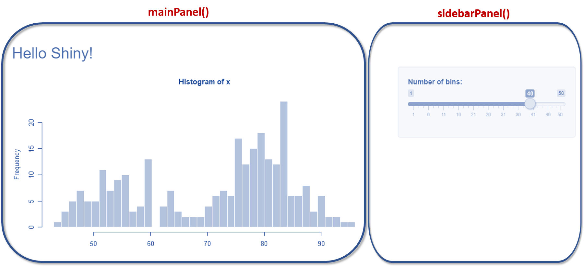
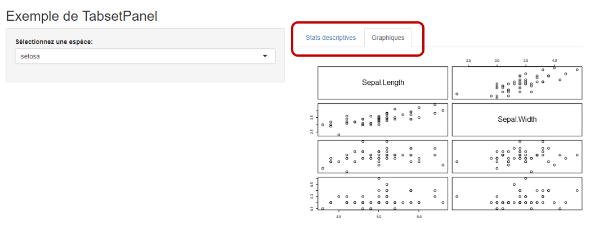
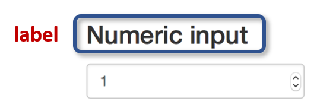
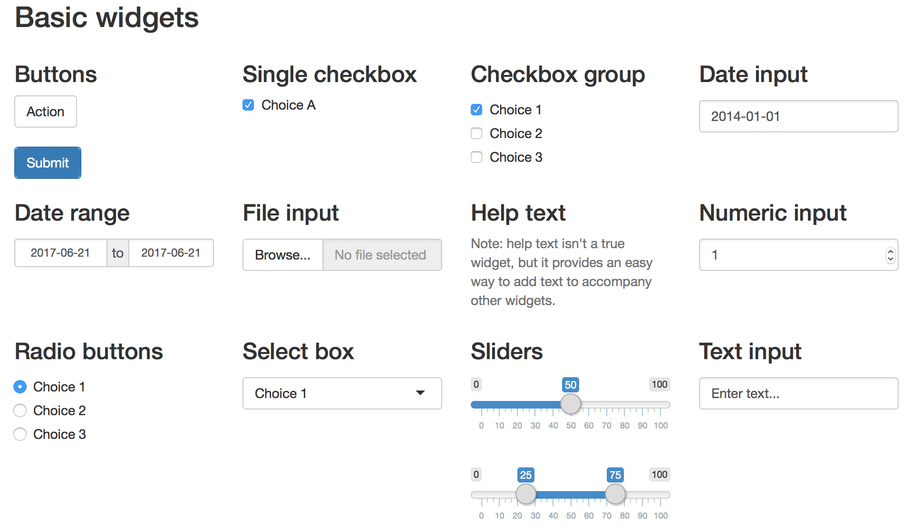
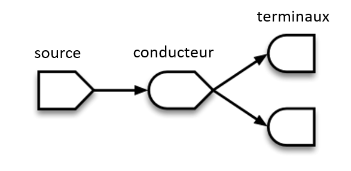
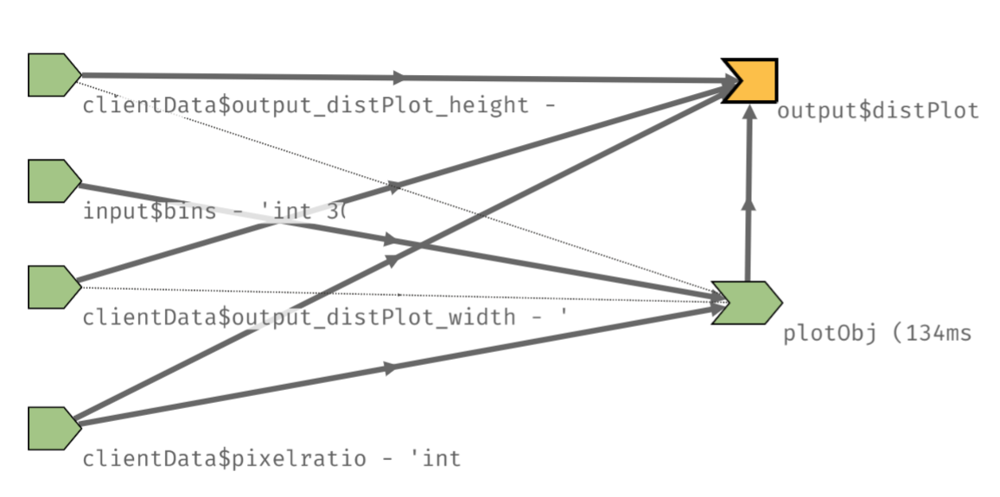

```{r setup, include=FALSE}

knitr::opts_chunk$set(echo = FALSE)

packages <- c(
  "rmarkdown",
  "shiny",
  "knitr",
  "tidyverse",
  "datapasta",
  "reshape2",
  "readxl",
  "lubridate",
  "reactlog",
  "data.table",
  "plotly",
  "highcharter",
  "rbokeh",
  "dygraphs",
  "DT",
  "markdown",
  "shinythemes",
  "shinyWidgets",
  "maps",
  "mapsdata",
  "mapview",
  "raster",
  "sp",
  "leaflet",
  "crosstalk",
  "gapminder",
  "rpivotTable"
)

lapply(packages, require, character.only = TRUE)
```

## Plan de la formation

<br> 
<b>
<font color="#515151">
Introduction: Pourquoi utiliser Shiny?
</br>
</font>
<br>
<br>
<font color="#5395CF">
1. Les concepts fondamentaux
</br>
<br> 
2. La construction de l'UI
</br>
<br> 
3. La construction du server
</br>
<br> 
4. Déploiement des applications
</br>
<br> 
5. L'écosystème Shiny
</br>
<br> 
6. Exercice final
</br>
</b>
</font>


# Pourquoi utiliser Shiny?

```{r, out.width = "30%"}

```

## Exemples d'applications

Shiny peut servir dans de nombreux domaines ou l'interactivité est importante.  
  
  

Voici quelques exemples:

<br><font color = "#515151"> Exemple 1 </font>  : [Exploration de données](https://vnijs.shinyapps.io/radiant/)</br> 

<br><font color = "#515151"> Exemple 2 </font> : [Dashboard (analyse des ventes)](https://mdancho84.shinyapps.io/shiny-app/) </br>  

<br><font color = "#515151"> Exemple 3 </font> : [Données spatiales](https://poissonconsulting.shinyapps.io/rtide/)</br>   

<br><font color = "#515151"> Exemple 4 </font> : [Utilisation de Google Cloud Vision](https://flovv.shinyapps.io/gVision-shiny/) </br>  

<br><font color = "#515151"> Exemple 5 </font> : [Analyse de textes](http://shiny.rstudio.com/gallery/word-cloud.html)</br> 

## Exécution de R au sein d'une présentation

Cette présentation est rédigée en R Markdown en utilisant `ioslides` et le moteur `shiny`.  

On peut donc exécuter du code R et afficher l'output:

```{r interactive}
  fluidPage(
    textInput("caption", "Taper l'expression ci-dessous", ""),
    verbatimTextOutput("value")
  )
renderPlot({
  output$value <- renderText({
    eval(parse(text=input$caption))
  })
})
```


## Popularité du package

On peut obtenir les statistiques de téléchargement des packages `R`, dont `Shiny`, avec [cette application en ligne](https://shinyus.ipub.com/cranview/)

```{r, out.width="90%"}

```

La version la plus récente (`1.2.0.9001`) date du [12 avril 2019](https://cran.r-project.org/src/contrib/Archive/shiny/), mais la première publication de RStudio concernant Shiny date de fin 2012

Le site de [RStudio](http://shiny.rstudio.com/) est très riche en références et tutoriels pour se perfectionner.


## Raison 1 : Simplicité
<br><b>
R Shiny = R + interactivité + web facilité</br></b>
<br></br>
Shiny est relativement facile à apprendre et à utiliser, même pour des personnes qui ne connaissent rien aux trois langages principaux du web qui sont:  

> - le `html` qui détermine le contenu et la structure
> - le `css` qui contrôle l'aspect (couleurs, polices de caractères, etc.) 
> - le `javascript` qui permet des animations

<br>
Une connaissance de `R` est suffisante pour accéder à une interface appelant des fonctionnalités, elles-mêmes originellement codées avec ces langages.</br>


```{r, out.width="30%"}
knitr::include_graphics("img/clients-web-riches.jpg")
```


## Raison 2 : Rapidité de développement

Le développement d'une application Shiny est souvent rapide à opérer. Son utilisation permet donc d'accélerer la mise sur le marché de données, de dataviz ou de modèles de machine learning.  

L'installation de R, RStudio et de quelques librairies est suffisante pour faire une application de A à Z.   

<br>Une fois l'application développée, il existe plusieurs solutions au sein même de RStudio pour la déployer en ligne.</br>

```{r, out.width="75%"}

```


## Raison 3 : Excellente solution de Dataviz

`Shiny` est une des rares solutions sur le marché permettant avec des outils <b>gratuits</b> de faire de la dataviz de qualité. A peu près n'importe quel graphique R peut être rendu interactif avec `Shiny`. 

`Shiny` a de plus le gros avantage sur beaucoup solutions (souvent trop statiques) de pouvoir ajouter de l'interactivité aux visualisations.

Les applications comprenant une dimension géospatiale sont particulièrement efficaces sous Shiny.

Il suffit d'explorer un site comme [Data-to-Viz](https://www.data-to-viz.com/) pour apprécier la qualité de ce qu'il est possible de faire.  

```{r, out.width="90%"}

```


## Raison 4 : le language R

`Shiny` s'adresse aux personnes connaissant déjà les bases de `R`, qui est maintenant un langage largement connu et répandu dans de nombreuses entreprises.   

Malgré la concurrence de plus en plus grande avec `Python`, il reste très compétitif pour le prototypage et l'analyse exploratoire, mais il peut aussi aller bien au delà des ces besoins. Des centaines de compagnies l'utilisent au quotidien :


```{r, out.width="65%"}

```


## Raison 5 : Potentiel très large

Les possibilités offertes par `Shiny` sont immenses, comme nous l'avons vu dans les exemples introductifs. 

Certains se sont même amusé à l'utiliser pour développer des [jeux](https://daattali.com/shiny/lightsout/) sous Shiny.

```{r, out.width="50%"}
knitr::include_graphics("img/instructions.png")
```


# Les concepts fondamentaux

```{r, out.width = "50%"}

```

## Prérequis et configuration 

Pour commencer à coder en Shiny, vous aurez simplement besoin :

A. D'installer R et le package R Shiny

```{r , eval=FALSE, echo=TRUE}
### <b> 
install.packages("shiny")
### </b> 
```

B. D'installer RStudio

```{r, out.width = "40%"}

```


## Qu'est qu'une application Shiny?

C'est une page web (`UI` = User Interface) connectée à un serveur (qui peut être un simple laptop) où tourne `R`.

Les utilisateurs peuvent manipuler l'UI, ce qui provoque des changements dans le serveur afin de mettre à jour ce qui est affiché (en exécutant du code `R`).  

Ceci est l'idée de base de l'expression réactive sur lequel Shiny repose.

```{r , eval=FALSE, echo=TRUE}
### <b> 
library(shiny)

ui <- fluidPage()
server <- function(input, output){}

shinyApp(ui = ui
         server = server)
### </b> 

```


Pour utiliser des termes de développement web, on peut dire qu'un développeur Shiny est <b>fullstack</b>, car il maîtrise:  

> le <b>backend</b>, qu'on appelle ici le `server`, qui est responsable de la logique de l'application,

> le <b>frontend</b>, qu'on appelle ici l'`UI`, qui permet de définir l'aspect de l'application.


## Un framework "Server-based"

Contrairement à d'autres frameworks comme `D3.js` où la machine client doit faire tous les calculs pour la visualisation, `Shiny` a l'avantage de ne pas reposer sur la puissance de la machine client car les calculs sont faits sur un serveur.  

Ceci s'avère très pratique lorsque l'application est hébergée en ligne. 

Le cycle ui-serveur peut être représenté simplement :

```{r, out.width = "100%"}

```

## Qu'est-ce que la réactivité?

Prenons un script R très simple:

```{r , eval=FALSE, echo=TRUE}
### <b> 
a <- 100
b <- a+1

a <- 200
### </b> 
```

Si on le lance, on aura `a == 200` et `b == 101`.

Dans un script R Shiny, ce sera différent : `a == 200` et `b == 201` du fait de la réactivité.  

Autrement dit, la valeur de `b` est automatiquement mise à jour lorsque `a` change, sans qu'il soit nécessaire de redonner l'instruction `b <- a+1`. 

Typiquement la valeur de `a` sera un <b>input</b> de l'application et `b` un <b>output</b>.


## Le template RStudio

Une façon simple de créer une application est de la créér au moyen du menu <i>File / New File</i> de RStudio:

```{r, out.width = "40%"}

```

Ceci donne le code pour exécuter l'application ci-dessous, dont on peut ensuite modifier le code :

```{r, out.width = "30%"}

```

<b>Remarque</b> : RStudio affichage un bouton <b>"Run App"</b> au-dessus du script à partir du moment où ce script se termine par `shinyApp(ui, server)`.

<u><b><br><font color = "#357EC7">Exemple</u></b></font> : `template_demo.R`</br>

## Template à l'aide d'un snippet RStudio

Une autre façon de créer un squelette d'application `shiny` est d'utiliser un <b>snippet</b> dans l'éditeur de script:


```{r, out.width = "40%"}

```

Ceci va automatiquement générer le code suivant:


```{r , eval=FALSE, echo=TRUE}
### <b> 
library(shiny)
ui <- fluidPage(
  )
server <- function(input, output, session) {
  }
shinyApp(ui, server)
### </b> 
```

## Options d'écriture et de lancement d'une application

Dans la plupart des exercices et démos, nous allons voir des applications <b>single file</b> dans le sens où toute l'application est écrite dans un seul script R.

Il est également possible d'écrire un script `ui.R` ainsi que `server.R` et de lancer l'application en pointant sur le dossier contenant ces 2 scripts

```{r , eval=FALSE, echo=TRUE}
### <b> 
shinyAppDir("nom_du_dossier")
### </b> 

```

Par ailleurs, lorsqu'on lance une application, on peut utiliser le mode "showcase" qui:

* affichera le code de l'application
* surlignera la partie du code influencée par un changement d'input
* fera apparaître du texte explicatif contenu dans un fichier markdown `Readme.md`

```{r , eval=FALSE, echo=TRUE}
runApp("D:/01_Soft_Computing/Data_Science/Formation_Shiny/live/02_Demos", ### <b> 
display.mode = "showcase")
### </b> 

```


## UI basique

Si l'on ne part pas d'un template, la première chose à faire est de choisir l'agencement (<b>layout</b> en anglais) des différentes parties de l'application.

La façon la plus simple d'organiser l'interface est de placer un `sidebarPanel` (pour les inputs) à gauche du `mainPanel` (pour les outputs)

```{r , eval=FALSE, echo=TRUE}
### <b> 
sidebarLayout(
  sidebarPanel(
    # Inputs
  ),
  mainPanel(
    # Outputs
  ))
### </b> 
```

```{r, out.width = "50%"}

```

## Emplacement du sidebarPanel

Il est également possible de placer le `sidebarPanel` à droite en écrivant

```{r , eval=FALSE, echo=TRUE}
sidebarLayout(
  ### <b> 
  position = "right",
  ### </b>
  sidebarPanel(
    # Inputs
  ),
  mainPanel(
    # Outputs
  ))

```

```{r, out.width = "55%"}

```


# La construction de l'UI


```{r, out.width = "50%"}
knitr::include_graphics("img/webapplication.png")
```

## Les agencements (layout / panel)

Selon la complexité de l'application, on peut ajouter d'autres types de panels que le `sidebar` et le `main`.  

```{r, out.width = "85%"}

```


Les `panels` permettent de réunir différents éléments, et il est possible de les emboîter.

> * `conditionalPanel()` permet d'afficher un objet selon la valeur de l'input

> * `tabsetPanel()` permet d'afficher des onglets pour subdiviser le mainPanel en plusieurs `tabPanel`

> * `absolutePanel()` permet de positionner les éléments du `mainPanel` de manière fixe

> * `verticalLayout()` permet d'afficher les éléments de l'UI verticalement

> * `splitLayout()` permet d'afficher les éléments de l'UI horizontalement, en colonnes égales

> * `flowLayout()` permet d'aligner les éléments de gauche à droite


## La fonction `conditionalPanel()`

Cette fonction permet de faire apparaitre (resp. cacher) des parties de l'UI en fonction de séléctions.


```{r echo=TRUE, , eval=FALSE}
ui <- fluidPage(
  column(4,
         wellPanel(
           sliderInput(
             "n", "Number of points:",
             min = 10, max = 200, value = 50, step = 10))),
  column(5,
### <b> 
    conditionalPanel("input.n >= 50",
                     plotOutput("scatterPlot", height = 300))
### </b> 
  ))

```

<b> Remarque </b>  : cette fonction fait appel à du Javascript, ce qui explique que l'appel de fonction soit avec `input.n` plutôt que `input$n`.  
Pour cette raison, il est préférable de ne pas mettre de points dans le nom de la variable (ici `n`).


<u><b><br><font color = "#357EC7">Exemple</u></b></font> : `conditionalPanel_demo.R`</br>


## La fonction `tabPanel()` avec `navbarPage()`

La fonction `navbarPage()` créé un menu dans lequel on peut encapsuler des sous-menus avec `tabPanel()`.

```{r , eval=FALSE, echo=TRUE}

ui <- fluidPage(
  ### <b>
  navbarPage("Cars dataset",tabPanel("Graphiques",
      ### </b>
      sidebarLayout(sidebarPanel(radioButtons(
        "plotType", "Plot type",c("Scatter" = "p", "Line" ="l"))),
      mainPanel(plotOutput("plot")))),
    ### <b>
    tabPanel("Stats descriptives",
     ### </b>
             verbatimTextOutput("summary")),
    ))
```


<b> Remarque </b> : pour ajouter des icônes dans les menus, il suffit d'indiquer le nom d'une icône disponible dans la librairie [Font Awesome](https://fontawesome.com/icons?d=listing&m=free).


```{r , eval=TRUE, echo=TRUE}
tabPanel("Tableau",
         DT::dataTableOutput("table"),
### <b> 
         icon = icon("table"))
### </b> 
```

<u><b><br><font color = "#357EC7">Exemple</u></b></font> : `navbar_demo.R`</br>


## La fonction `tabsetPanel()`

Cette fonction permet de créer des onglets en imbriquant par exemple 2 `tabPanel()`

```{r , eval=FALSE, echo=TRUE}
### <b> 
tabsetPanel(
  tabPanel("Stats descriptives", tableOutput("table")),
  tabPanel("Graphiques", plotOutput("plot")))
### </b> 
```

```{r, out.width = "80%"}

```


<u><b><br><font color = "#357EC7">Exemple</u></b></font> : `tabsetPanel_demo.R`</br>


## La fonction `absolutePanel()`

Cette fonction permet de créer des panels de tailles et positions fixes. On peut par exemple:

* positionner un panel en haut de la page avec l'option `fixed = TRUE`
* faire en sorte que ce panneau soit flottant avec l'option `draggable = TRUE`

```{r, out.width = "60%"}

```

<u><b><br><font color = "#357EC7">Exemple</u></b></font> : `absolutePanel_demo.R`</br>


## La fonction `verticalLayout()`

Comme son nom l'indique, cette fonction permet de positionner les éléments de façon verticale.

```{r , eval=FALSE, echo=TRUE}

ui <- fluidPage(
  ### <b> 
  verticalLayout(
  ### </b> 
    titlePanel("Exemple de vertical layout"),
    plotOutput("plot1"))
```


```{r, out.width = "45%"}

```


<u><b><br><font color = "#357EC7">Exemple</u></b></font> : `verticallayout_demo.R`</br>


## La fonction `splitLayout()`

Cette fonction permet par exemple d'agencer les éléments selon des ratios prédéfinis :

```{r , eval=FALSE, echo=TRUE}

ui <- fluidPage(### <b>
  splitLayout(
    cellWidths = c("25%", "25%", "50%"),
    ### </b>
    plotOutput("plot1"),
    plotOutput("plot2"),
    plotOutput("plot3"))
  
```


```{r, out.width = "65%"}

```


<u><b><br><font color = "#357EC7">Exemple</u></b></font> : `splitlayout_demo.R`</br>


## La fonction `flowLayout()`

Cette fonction permet par exemple d'agencer les éléments automatiquement les uns après les autres (de gauche à droite, et de haut en bas) :

```{r , eval=FALSE, echo=TRUE}

ui <- fluidPage(### <b>
  flowLayout(
    ### </b>
    numericInput("rows", "Combien de lignes?", 5),
    selectInput("letter", "Quelle lettre?", LETTERS),
    sliderInput("value", "Quelle valeur?", 0, 100, 50)
  ))

```


```{r, out.width = "65%"}

```


<u><b><br><font color = "#357EC7">Exemple</u></b></font> : `flowlayout_demo.R`</br>


## Remarque sur la nature sous-jacente de l'UI

Nous avons dit précédemment que l'UI était une page web. Pour s'en convaincre, il suffit de créer un UI...

```{r , eval=TRUE, echo=TRUE}
### <b> 
library(shiny)
ui <- fluidPage(
    titlePanel("Ceci est un titre"),
  sidebarLayout(
    sidebarPanel("emplacement des inputs"),
    mainPanel("emplacement des outputs")
  ))
### </b> 
```

... et ensuite d'afficher l'objet:

```{r, eval=TRUE, echo=TRUE}
### <b> 
print(ui)
### </b> 
```


## Les tags HTML

Pour aller un peu plus loin sur la façon dont Shiny gère le `HTML`, on peut lister quelques tags disponibles (parmi une liste de 110) :

```{r, eval=TRUE, echo=TRUE}
taglist <- shiny::tags
### <b> 
names(taglist)[1:10]
### </b> 
```

Exemple d'utilisation:

```{r, eval=TRUE, echo=TRUE}
### <b> 
tags$h1("Titre 1")
### </b> 
```

```{r, eval=TRUE, echo=TRUE}
### <b> 
tags$h2("Titre 2")
### </b> 
```


## Application des tags HTML

On peut modifier la présentation du texte de l'UI à l'aide des tags:


```{r, eval=TRUE, echo=TRUE}

ui = fluidPage(titlePanel(
  ### <b> 
  div("Des goûts et des couleurs:", style = "color: green")),
  ### </b> 
               sidebarLayout(sidebarPanel(
                   ("Mes plats favoris sont:"),
                   br(),
                   ### <b> 
                   h4(strong("la pizza"), "de chez", em("Papa Raffaele")),
                   h3(strong("les sushis"), "de chez", code("Jomon")),
                   div(strong("les tagines"), "de la Menara", style = "color: red")
                   ### </b> 
               ),
               mainPanel()))
server = function(input, output) { }
shinyApp(ui, server)

```


## Ajout d'inputs dans l'UI

Les inputs de l'application peuvent être par exemple:

* une valeur numérique avec `numericInput()`, 

* du texte avec `textInput()`, 

* une date avec `dateInput()`,

Afin de régler la façon dont l'utilisateur saisi le(s) input(s), il existe ce qu'on appelle des <b>widgets</b>.

Toutes les fonctions d'input prennent au moins 2 <b>arguments</b> : 

* `inputId` qui est le nom sous lequel Shiny va reconnaître l'input.  
Il doit par conséquent être unique, avec pour valeur `input$<inputId>`

* `label` qui va servir de descriptif dans les widgets


```{r, out.width = "25%"}

```

Chacune de ces fonctions peut avoir d'autres arguments spécifiques.


## Les widgets de contrôle

[Gallerie](http://shiny.rstudio.com/gallery/widget-gallery.html)

```{r, out.width = "90%"}

```


## Widgets de contrôle | Input numérique

L'<b>input numérique</b> permet de sélectionner une valeur numérique.

<div class="columns-2">

```{r , eval=FALSE, echo=TRUE}
###<b>
numericInput(inputId, label, value,
             ###</b>
             min = NA, max = NA, step = NA)

```


</div>

<u><b><br><font color = "#357EC7">Exemple</u></b></font> : `numeric_input.R`</br>

## Widgets de contrôle | Boutons radio

Les <b>boutons radio</b> permettent de sélectionner une valeur numérique (unique) au sein d'une liste de choix.

<div class="columns-2">

```{r , eval=FALSE, echo=TRUE}
ui <- fluidPage(
  ###<b>  
  radioButtons("radio",
        label = h3("Radio buttons"),
        choices = list(
            "Choice 1" = 1,
            "Choice 2" = 2,
            "Choice 3" = 3), selected = 1)
###</b>
```


</div>

<u><b><br><font color = "#357EC7">Exemple</u></b></font> : `radio_buttons.R`</br>


## Widgets de contrôle | Slider

Le <b>slider</b> permet de sélectionner une valeur numérique dans un intervalle déterminé en utilisant un curseur.  

Il existe de nombreuses options permettant de définir l'intervalle, le format, l'animation, etc.

```{r, out.width = "45%"}

```


<u><b><br><font color = "#357EC7">Exemple</u></b></font> : `sliders_input.R`</br>


## Widgets de contrôle | Checkbox

La <b>checkbox</b> permet de sélectionner une (ou plusieurs) valeur(s) en cochant des cases au choix.

<div class="columns-2">

```{r , eval=FALSE, echo=TRUE}
###<b>
checkboxGroupInput(inputId, label, 
                     ###</b>
                   choices = NULL, selected = NULL,
                   inline = FALSE, width = NULL, 
                   choiceNames = NULL, 
                   choiceValues = NULL)

```


</div>

<u><b><br><font color = "#357EC7">Exemple</u></b></font> : `checkbox_input.R`</br>


## Widgets de contrôle | Input select box

L'<b>input select box</b> permet de sélectionner une valeur en sélectionnant dans un menu déroulant.

<div class="columns-2">

```{r , eval=FALSE, echo=TRUE}
###<b>
selectInput(inputId, label, choices, 
            ###</b>
            selected = NULL, multiple = FALSE,
            selectize = TRUE, 
            width = NULL, size = NULL)

```


</div>

<u><b><br><font color = "#357EC7">Exemple</u></b></font> : `select_input.R`</br>


## Widgets de contrôle | Input date

L'<b>input date</b> permet de sélectionner une date en sélectionnant dans le calendrier.

<div class="columns-2">

```{r , eval=FALSE, echo=TRUE}
###<b>
dateInput(inputId, label, 
          ###</b>
          value = NULL, min = NULL, max = NULL,
          format = "yyyy-mm-dd", startview = "month", 
          weekstart = 0, language = "en", 
          width = NULL, autoclose = TRUE,
          datesdisabled = NULL, 
          daysofweekdisabled = NULL)

```


</div>

<u><b><br><font color = "#357EC7">Exemple</u></b></font> : `date_input.R`</br>


## Widgets de contrôle | Input texte

L'<b>input texte</b> permet de saisir du texte.

<div class="columns-2">

```{r , eval=FALSE, echo=TRUE}
###<b>
selectInput(inputId, label, choices, 
            ###</b>
            selected = NULL, multiple = FALSE,
            selectize = TRUE, 
            width = NULL, size = NULL)


```


</div>

<u><b><br><font color = "#357EC7">Exemple</u></b></font> : `text_input.R`</br>


## Widgets de contrôle | Input file

L'<b>input file</b> permet d'uploader un fichier, le plus souvent de données.

<div class="columns-2">

```{r , eval=FALSE, echo=TRUE}
###<b>
fileInput(inputId, label, 
          multiple = FALSE, 
          accept =  c(
          "text/csv",
          "text/comma-separated-values,text/plain",
          ".csv"),
  width = NULL, buttonLabel = "Browse...",
  placeholder = "No file selected")
### </b>

```


</div>

<u><b><br><font color = "#357EC7">Exemple</u></b></font> : `file_input.R`</br>


## Widgets de contrôle | shinyWidgets

Le package `shinyWidgets` permet de choisir d'autres couleurs et d'autres styles de widgets de contrôle.


<u><b><br><font color = "#357EC7">Exemple</u></b></font> : `shinywidgets_input.R`</br>

## Ajout d'outputs dans l'UI

Après avoir configuré les éléments d'inputs, il faut ajouter les éléments d'output dans l'UI.

Ces outputs peuvent être de toute nature :

* graphiques
* tableaux
* textes
* etc.

Il faut bien comprendre qu'à ce stade, on ne décide que de <b>l'emplacement</b> et de <b>l'identifiant</b> des outputs, car ceux-ci n'existeront réellement que lorsque l'étape du `server` sera terminée.

Comme pour les inputs:

* il existe une fonction `shiny` pour chaque type d'output,
* chaque `outputId` doît être unique.

## Ajout d'outputs dans l'UI | `render()` vs `output`

Les fonctions d'output à mettre dans la partie `ui` (et les fonctions d'output correspondantes à mettre dans le `server`) sont:

* `verbatimTextOutpout()` / `renderPrint()`  pour le texte à  la façon de la console R

* `textOutput()` / `renderText()` pour des chaînes de caractères

* `plotOutput()` / `renderPlot()`  pour les graphiques

* `tableOutput()` / `renderTable()` pour les tableaux de données

* `imageOutput()` / `renderImage()` pour les images

* `uiOutput()` & `htmlOutput()` / `renderUI()` pour mettre en forme, notamment avec des balises HTML

Le principe est qu'un output `ui` sera automatiquement mis à jour quand un input de sa fonction `render()` sera mis à jour sur le server.

## Les fonctions d'output pour le texte

Il existe plusieurs façons d'imprimer du texte qui sont illustrés ci-dessous :


```{r , eval=FALSE, echo=TRUE}
###<b>
ui <- fluidPage(verbatimTextOutput("renderprint"),
    verbatimTextOutput("rendertext"),
    textOutput("rendertext1"))

server <- function(input, output, session) {
    output$renderprint <- renderPrint({
        print("Ceci est un output avec renderPrint + verbatimTextOutput")})  
    output$rendertext <- renderText({
        "Ceci est un output avec renderText + verbatimTextOutput"})
    output$rendertext1 <- renderText({
        "Ceci est un output avec renderText + textOutput"})}
###</b>

```

```{r, out.width = "50%"}

```

<u><b><br><font color = "#357EC7">Exemple</u></b></font> : `textOutput.R`</br>


## Les fonctions d'output pour les graphiques

La fonction `plotOutput` permet d'afficher un output graphique réactif :

```{r , eval=FALSE, echo=TRUE}
ui <- flowLayout(
    sliderInput("slider", label = h3("Choisir le nombre d'observations"), min = 1, max = 50, value = 25),
###<b>
    plotOutput("plot"))
###</b>
server <- function(input, output) {
###<b>  
  output$plot <- renderPlot({
    ###</b>
        cars2 <- cars %>% sample_n(input$slider)
        plot(cars2, pch=3,col = "Orange")})}
```

```{r, out.width = "35%"}

```

<u><b><br><font color = "#357EC7">Exemple</u></b></font> : `plotOutput.R`</br>

## Les fonctions d'output pour les tableaux

La fonction `tableOutput` permet d'afficher un output tableau réactif :

```{r , eval=FALSE, echo=TRUE}
ui <- fluidPage(fluidRow(column(12,
                   ###<b>            
       tableOutput('table'))))
###</b>
server <- function(input, output) {
  ###<b>
    output$table <- renderTable({
      ###</b>
        iris2})}

```

```{r, out.width = "35%"}

```

<u><b><br><font color = "#357EC7">Exemple</u></b></font> : `tableOutput.R`</br>

## Les fonctions d'output pour les images

La fonction `imageOutput` permet d'afficher un output image réactif :

```{r , eval=FALSE, echo=TRUE}
ui <- fluidRow(
    radioButtons(
    column(4,  ###<b>
      imageOutput("image2"))
  ###</b>
server <- function(input, output) {
  ###<b>
  output$image2 <- renderImage({  ###</b>
    if(input$radio == "setosa"){            
      list(src = "images/iris_setosa.jpg", height = 240, width = 300)
    } 

```

```{r, out.width = "20%"}

```

<u><b><br><font color = "#357EC7">Exemple</u></b></font> : `imageOutput.R`</br>

## Les fonctions d'output UI / html

`htmlOutput` est une fonction particulière, car elle permet de générer une ui dynamique : autrement dit, elle permet de créer des objets réactifs qui dépendent de l'input de l'utilisateur.   
Ceci permet par exemple de zoomer au sein d'une zone géographique.

```{r , eval=FALSE, echo=TRUE}
ui <- fluidPage(sidebarPanel( ### <b>
      htmlOutput("country_selector")))
      ### </b>

server <- function(input, output) {
  ### <b> 
  output$country_selector = renderUI({ 
  ### </b>  
    selectInput(inputId = "state", label = "Pays:", 
                choices = as.character(unique(df$country)), selected = "france")  })}
```

```{r, out.width = "35%"}

```

<u><b><br><font color = "#357EC7">Exemple</u></b></font> : `htmlOutput.R`</br>


## Les thèmes Shiny

Le thème par défaut des applications Shiny est dérivé du framework [Bootstrap](https://getbootstrap.com). 

La librairie [ShinyThemes](https://rstudio.github.io/shinythemes) permet d'utiliser 16 thèmes prédéfinis :

```{r, out.width = "66%"}

```

<u><b><br><font color = "#357EC7">Exemple</u></b></font> : `shinythemes_demo.R`</br>


# La construction du server


```{r, out.width = "30%"}

```

## Retour sur la réactivité

[](https://shiny.rstudio.com/articles/reactivity-overview.html
)
Dans Shiny nous avons 3 classes d'objets réactifs :

* les sources réactives
* les conducteurs réactifs
* les terminaux réactifs

```{r, out.width = "50%"}

```

  
La plus simple des relations entre une <b>source</b> et un <b>terminal</b> est décrite dans le schéma suivant :

```{r, out.width = "30%"}

```

## Le conducteur réactif

Si l'on multiplie les sources et les terminaux, on peut avoir besoin d'un objet intermédiaire : le conducteur réactif

```{r, out.width = "30%"}

```

Une façon de voir ces 3 classes d'objets Shiny est d'utiliser le concept de filiation:

* un conducteur réactif peut à la fois dépendre d'autres objets et avoir des dépendances en même temps ("parent" et "enfant")
* une source n'a que des dépendances ("parent")
* un terminal ne peut que dépendre d'autres objets ("enfant")


## Valeurs, expressions et observateurs

Les <b>valeurs réactives</b> contiennent tout simplement des valeurs qui peuvent être lues par d'autres objets réactifs. C'est <b>l'input</b> qui est sélectionné par l'utilisateur, ou bien par exemple selon le temps qui s'écoule. 

L'implémentation de la notion de <b>conducteur réactif</b> est appelée <b>expression réactive</b>.  

Cela sert de cache mémoire lorsque l'utilisateur change l'input, lors d'actions telles que:

* l'accès à une base ou un fichier de données
* l'exécution d'un calcul gourmand en ressources

Enfin, les <b>terminaux réactifs</b> sont autrement appelés <b>observateurs</b>.   

Ils accèdent aux valeurs et conducteurs réactifs. Leur rôle est, la plupart du temps, d'envoyer des données vers l'interface (navigateur web).   

C'est tout simplement <b>l'output</b> du server.

## Le package `reactlog`

Pour illustrer quelques notions que nous venons de voir, le package `reactlog` peut être utile :

```{r, out.width = "70%"}

```

Ce package permet en effet de créer un graphique qui représente toutes les interactions entre les éléments réactifs de l'application.  

<u><b><br><font color = "#357EC7">Exemple</u></b></font> : `reactlog_demo.R`</br>


## La fonction `render()`

Comme nous l'avons déjà vu, la fonction `render()` est fonction de base pour gérer l'output dans le serveur.  

Il en existe plusieurs (`renderDataTable`, `renderPlot`, etc.) selon le type d'output.  

Chacune d'entre elles contient comme argument une expression (entre `{}`) qui peut être plus ou moins complexe.

```{r , eval=FALSE, echo=TRUE}
  ### <b> 
server <- function(input, output) {
    output$selected_var <- renderText({ 
    paste("You have selected", input$var)
  })}  ### </b> 

```


Cette expression est un ensemble d'instructions qui va être lancé en même temps que l'application, puis re-exécuté chaque fois que l'objet est mis à jour.  

Autrement dit, l'utilisation de `render()` indique que l'expression qui y est contenue ne doit être exécutée que lorsque ses dépendances (généralement `input$`) changent.


## La fonction `reactive()`

Cette fonction permet de s'assurer que: 

* l'expression réactive n'est executée que lorsque l'input dont elle dépend est modifié
* les résultats du calcul de l'expression sont partagés par l'ensemble de l'application, ce qui implique que ce calcul n'est effectué qu'une seule fois.
    
```{r , eval=FALSE, echo=TRUE}
### <b> 
server <- function(input, output) {
    datasetInput <- reactive({
        switch(input$dataset,
               "rock" = rock,
               "pressure" = pressure,
               "cars" = cars) })
    output$view <- renderTable({head(datasetInput(), n = input$obs)}) 
    }
### </b> 

```

A noter dans l'exemple : `output$view` dépend de 2 inputs, et sera donc actualisé à chaque fois que l'un ou l'autre sera modifié.


<u><b><br><font color = "#357EC7">Exemple</u></b></font> : `reactive_function.R`</br>


## La fonction `isolate()`

Cette fonction permet de faire calculer un output qui ne soit pas réactif, bien que dépendant de l'input.  

Dans l'exemple ci-dessous, du fait de l'encapsulation de l'expression dans `isolate()`, l'affichage du graphique de distribution ne sera pas ré-exécuté systématiquement à chaque changement de la valeur réactive `input$obs`.  

Le graphique ne sera actualisé que si l'on clique sur l'`actionButton` (étiqueté "goButton" dans l'UI).  

```{r , eval=FALSE, echo=TRUE}

server <- function(input, output) {
  output$distPlot <- renderPlot({
    input$goButton
   ### <b>       
    dist <- isolate(rnorm(input$obs))
    ### </b> 
    hist(dist)
  })}
```

Il faut comprendre ici que du fait de la réactivité, bien que le vecteur dist soit calculé à chaque changement d'input, le `plot` n'est affiché qu'au clic.

<u><b><br><font color = "#357EC7">Exemple</u></b></font> : `isolate_function.R`</br>


## La fonction `eventReactive()`

Nous venons de voir avec la fonction `isolate()` qu'il est parfois nécessaire d'attendre que l'utilisateur prenne une action spécifique (comme un clic sur un `actionButton`) avant d'effectuer un calcul.   
Une valeur ou expression réactive qui sert de déclencheur est appelé un `event`.  


Dans l'exemple ci-dessous, `eventReactive()` permet d'afficher les x premières lignes de données, à chaque fois qu'on clique sur le bouton "Montrer"

```{r , eval=FALSE, echo=TRUE}
server <- function(input, output) {
### <b> 
    df <- eventReactive(input$button, { head(cars, input$x)})
### </b> 
    output$table <- renderTable({df()})
}
```

Autrement dit, `eventReactive()` génère une nouvelle valeur qui ne se met à jour qu'en réponse à un événement.

<u><b><br><font color = "#357EC7">Exemple</u></b></font> : `eventReactive_function.R` </br>


## Les modules Shiny

En théorie une application Shiny peut très bien fonctionner en utilisant des fonctions classiques, mais on peut faire face à plusieurs problèmes lors du développement d'une application plus complexe, du fait notamment que les ids d'input et output doivent être uniques.

Une solution adoptée par beaucoup de langages de programmation (Java, C++, etc.) consiste à créer des <b>espaces de noms</b> ("namespace" en anglais) qui auront des noms distincts mais peuvent contenir des ids identiques entre espaces.  

Dans le contexte de Shiny, on appelle ces <b>espaces de noms</b> des <b>Shiny modules</b>, qui ne sont en fait que des morceaux d'application Shiny, dans le sens où on ne peut les executer seuls.

Ces modules Shiny peuvent:  

* remplacer n'importe quelle partie d'une application (input, output) 
* être ré-utilisés entre applications.

Nous ne décrirons pas ici les particularités dans la programmation de ces modules : plus de détails sont disponibles [ici](https://shiny.rstudio.com/articles/modules.html) ou encore [là](https://idc9.github.io/stor390/notes/shiny.html#shiny_modules).


<u><b><br><font color = "#357EC7">Exemple</u></b></font> : `shiny_modules.R` </br>


## Annexe | Utilisation d'un fichier `global.R`

Dans beaucoup d'applications, vous allez avoir besoin de faire quelques opérations sur les données telles que :

* le chargement du fichier source (type .csv)
* la connexion à une base de données 
* le chargement de packages
* la définition de fonctions spécifiques
* la définition de constantes
* la mise en forme des données
* etc.

Un moyen de centraliser ces opérations en dehors de l'application elle-même est de créer un fichier `global.R` qui sera hébergé dans le même répertoire que le reste de l'application (`app.R` par exemple).

Cette méthode a l'avantage d'améliorer la rapidité d'exécution, car le script ne s'exécute qu'une seule fois au lancement de l'application et créé des variables et fonctions globales.


# Déploiement des applications


```{r, out.width = "50%"}
knitr::include_graphics("img/shinyapp.png")
```

## Déploiement en local

La façon la plus simple de partager une application Shiny est de zipper le répertoire contenant tous les éléments de l'application et de l'envoyer aux utilisateurs (par email, usb, etc.).   

Il suffit ensuite à l'utilisateur de lancer l'application sur son poste avec la commande `shiny::runApp`.

Cette méthode est rapide, mais a 2 inconvénients:

1. l'utilisateur doit avoir R sur son poste, ainsi que tous les packages utilisés dans l'application
2. toute mise à jour de l'application nécessite de refaire toute la procédure

Une autre façon de déployer en local est de créer une fonction, un package ou un exécutable.  
Ces méthodes sont évoquées dans les slides suivantes.

```{r, out.width = "30%"}

```

## Déploiement sous forme de fonction

Il est tout à fait possible de transformer une application Shiny en fonction R plus classique : il suffit pour cela de paramétrer la fonction `shinyApp`.   

Dans l'exemple, nous allons construire une fonction `binner` qui:

* prend en paramètre le nombre de barres `x` que doit comporter l'histogramme
* prend en input un fichier `csv` comprenant la série de nombres à représenter

L'output de cette fonction est alors l'histogramme.


<u><b><br><font color = "#357EC7">Exemple</u></b></font> : `shiny_function.R` </br>

## Déploiement sous forme de package

Au sein de nombreux packages existent des petits applications Shiny permettant de faire une démo des capacités du package en question. (exemple : package esquisse)  

Le package `golem` (voir [cette page](https://thinkr-open.github.io/golem/)) procure un template pour développer une application sous cette forme. 


```{r, out.width = "50%"}
knitr::include_graphics("img/golem.png")
```


## Déploiement sous forme d'exécutable | le package `RInno`


```{r, out.width = "15%"}

```

L'idée derrière [ce package ](https://github.com/ficonsulting/RInno) est d'encapsuler l'application Shiny au sein d'un exécutable (`.exe`) grâce au framework [Electron](https://github.com/electron/electron) de GitHub.

```{r , eval=FALSE, echo=TRUE}
### <b>
create_app(
  app_name    = "My AppName", 
  app_dir     = "My/app/path",
  pkgs        = c("jsonlite", "shiny", "magrittr", "xkcd"),  # CRAN-like repo packages
  include_R   = TRUE,     # Download R and install it with your app, if necessary
  R_version   = "2.2.1",  # Old versions of R
  default_dir = "pf")     # Install app in to Program Files
### </b>
```

## Déploiement sous forme de container


```{r, out.width = "30%"}
knitr::include_graphics("img/Docker-Logo.png")
```


Dans la continuité de la mise en package évoquée plus haut, l'utilisation de <b>Docker</b> permet de constuire une image, constituant alors <b>un environnement isolé du reste de la machine qui contient tout ce qu’il faut pour faire tourner une application</b>.

Autrement dit, on peut alors distribuer l'application Shiny sans se préoccuper de la configuration de la machine de l'utilisateur.


[Cette page](https://thinkr.fr/dockeriser-application-shiny/) décrit le processus, qui est cependant assez complexe pour quelqu'un qui ne serait pas à l'aise avec les notions avancées de programmation.

## Déploiement en ligne | Shinyapps.io

Ce [site web](https://www.shinyapps.io/) permet en quelques clics, sans quitter Rstudio, de publier une application en ligne. Exemple [ici](https://alexkruse.shinyapps.io/stadtrad/)


```{r, out.width = "30%"}

```

Il existe une version gratuite ayant l'inconvénient de rendre publique votre application.   
Il faut compter environ 90€ par mois pour en sécuriser l'accès.  

Le site permet d'administrer les applications en ligne :

* en leur allouant plus ou moins de ressources
* en surveillant les statistiques d'accès


## Déploiement en ligne | Rstudio.cloud

Cet autre [site web](https://www.rstudio.cloud/) permet d'utiliser RStudio sans l'installer sur son poste, depuis un navigateur web type Chrome.


```{r, out.width = "40%"}

```

Le site permet donc d'héberger et faire tourner un script en ligne, comme s'il était en local.  

Il suffit de partager un lien (exemple [ici](https://rstudio.cloud/project/596222)) et de demander à l'utilisateur de lancer le script avec la commande "Run Document" pour faire une démo. 


## Déploiement sur un Shiny Server

```{r, out.width = "5%"}

```

<b>Shiny Server</b> existe en 2 versions : 

* la version <b>Open Source</b> (gratuite) qui peut être installée sur n'importe quel serveur 
* la version <b>Pro</b> (payante) qui dispose de beaucoup plus de fonctionnalités (sécurisation, logs, scheduler, etc.)

<br>
<b>RStudio Connect</b> permet également de publier des applications Shiny en ligne, parmi d'autres fonctionnalités collaboratives bien plus étendues.
</br>

<br>
```{r, out.width = "15%"}

```

<b>Shinyproxy</b> est une solution complémentaire permettant de mieux faire face aux challenges induits en entreprise par le déploiement d'une application multi-utilisateurs de façon sécurisée (LDAP, TLS, etc.).   
C'est une technologie basée sur Java et Docker.
</br>  

Il existe aussi le [package](https://github.com/AndreaCirilloAC/ramazon) `ramazon` qui propose d'installer une application sur le cloud Amazon.   
De multiples tutoriels en lignes expliquent comment déployer sur d'autres providers, mais cela reste relativement complexe pour les néophytes.


# L'écosystème Shiny


```{r, out.width = "50%"}

```


## Les documents et présentations Shiny

Un phénomène notable dans le domaine de l'analyse de données ces dernières années est l'apparition de publications au format notebook.

Ce format permet au sein d'un même document d'afficher l'analyse et le code :

* plan et commentaires, 
* code résultats du code.

```{r, out.width = "50%"}

```

Shiny permet d'ajouter une autre dimension intéressante : l'<b>interactivité</b>. 


## Documents Shiny | Intégration au RMarkdown

Le R Markdown est le langage de base des notebooks. Il permet grâce à un système de balises (comme pour le `HTML`) de mettre en forme du texte, et de générer un document dans un format de votre choix (html, word, pdf, etc.).  

Dans RStudio, on peut créer un document html avec des composants Shiny en faisant `File -> New File -> R Markdown`, en finissant par le choix <b>Shiny Document</b>

```{r, out.width = "40%"}

```


<u><b><br><font color = "#357EC7">Exemple</u></b></font> : `shinydoc_demo.Rmd`</br>


## Les dashboards

Shiny permet, couplé à du RMarkdown, de générer des dashboards interactifs de qualité tout à fait comparable à de nombreux autres outils BI type <b>Qlik, Power BI </b> ou <b>Tableau</b>.

La différence essentielle tient au fait que la construction du dashboard se fait en codant avec les langages R et RMarkdown plutôt qu'avec une interface clic-bouton.  

<br>
Les 2 packages les plus utilisés abordent le codage du dashboard de façon différente:

* `shinydashboard` est une sorte d'extension du package `shiny` avec des éléments d'UI spécifiques (comme par exemple `dashboardSidebar`)

* `flexdashboard` est un template R Markdown adapté à la création de dashboards


```{r, out.width = "50%"}

```
</br>

## Dashboards | Shinydashboard

`shinydashboard` se compose avec du pur code `shiny`, mais avec quelques fonctions spécifiques :

```{r , eval=FALSE, echo=TRUE}
### <b>
library(shinydashboard)

dashboardPage(
  dashboardHeader(),
  dashboardSidebar(),
  dashboardBody(tabItems(
        tabItem(tabName = "Onglet",
                fluidRow()
)
### </b>
```


<u><b><br><font color = "#357EC7">Exemple</u></b></font> : `shinydashboard_demo.R`</br>

## Dashboards | Flexdashboard

`flexdashboard` se compose comme un document <b>R Markdown</b>, avec une trame déterminée par des mots clés tels que `Column`, `{.sidebar}` ou encore `{.tabset}`

Il suffit d'inclure `runtime: shiny` dans l'entête du script pour pouvoir y inclure des éléments Shiny.  


```{r, out.width = "50%"}

```


<u><b><br><font color = "#357EC7">Exemple</u></b></font> : `flexdash_demo.Rmd`</br>

## Les htmlwidgets

Les [HTML widgets](https://www.htmlwidgets.org/showcase_leaflet.html) peuvent être utilisés dans R à partir d'un simple script comme depuis du R Markdown ou au sein d'une application Shiny. 

Parmi les [107 widgets](http://gallery.htmlwidgets.org/) disponibles à ce jour, nous allons passer en revue: 

* des widgets de <b>dataviz</b> : Plotly, Highcharter, Bokeh et Dygraphs
* des widgets de <b>tableaux de données</b> : DT et rpivotTable
* des widgets de <b>cartographie</b> : Leaflet et mapview

```{r, out.width = "90%"}

```


Enfin, nous évoquerons `crosstalk` qui est un add-on permettant de faire interagir les widgets.


## Htmlwidgets de dataviz | Plotly

<b>Plotly</b> peut fonctionner de 2 façons: avec une syntaxe propre, ou en convertissant un objet `ggplot2`.  

```{r fig.height=4, fig.width=8, message=FALSE, warning=FALSE, include=TRUE}
library(plotly)

d <- diamonds[sample(nrow(diamonds), 1000), ]

plot_ly(
  d, x = ~carat, y = ~price,
  color = ~carat, size = ~carat
)

```


<u><b><br><font color = "#357EC7">Exemple</u></b></font> : `plotly_demo.R`</br>

## Htmlwidgets de dataviz | Highcharter

<b>Highcharts</b> est à l'origine une librairie javascript dont la principale qualité est la consistence entre les différents types de graphs, ainsi que leur simplicité.  


```{r fig.height=3, fig.width=6, message=FALSE, warning=FALSE, include=TRUE}

library(highcharter)

highcharts_demo() %>%
    hc_chart(type = "column") %>%
    hc_size(width = 800, height = 350)

```

<u><b><br><font color = "#357EC7">Exemple</u></b></font> : `highcharter_demo.R`</br>

## Htmlwidgets de dataviz | Bokeh

<b>Bokeh</b> est une librairie de dataviz qui a des interfaces en Python, Scala, Julia et R.  

<br>

```{r fig.height=4, fig.width=8, message=FALSE, warning=FALSE, include=TRUE}
library(rbokeh)
figure(width = 600, height = 300) %>%
  ly_points(Sepal.Length, Sepal.Width, data = iris, color = Species) %>%
  tool_box_select() %>%
  tool_lasso_select()

```

<u><b><br><font color = "#357EC7">Exemple</u></b></font> : `bokeh_demo.R`</br>

## Htmlwidgets de dataviz | dygraphs

<b>dygraphs</b> est à l'origine une librairie `JavaScript` open source permettant de tracer des séries temporelles.

La libraire `dygraphs` reconnait en particulier automatiquement les objets R au format `xts`. L'exemple ci-dessous ajoute un curseur pour sélectionner un intervalle de temps en abscisse :

```{r include=TRUE, fig.width=10, fig.height=3}

lungDeaths <- cbind(ldeaths, mdeaths, fdeaths)

library(dygraphs)

dygraph(lungDeaths, main = "Deaths from Lung Disease (UK)") %>%
    dyHighlight(highlightSeriesOpts = list(strokeWidth = 3)) %>%
    dyRangeSelector() %>%
    dyOptions(colors = RColorBrewer::brewer.pal(3, "Set2"))

```

<u><b><br><font color = "#357EC7">Exemple</u></b></font> : `dygraphs_demo.R`</br>


## Htmlwidgets de données | DT

<b>DataTables</b> est à l'origine un plug-in pour la librairie `JQuery` permettant d'afficher des tableaux de données interactifs.

La libraire `DT` offre une interface R à ce plug-in, avec la possibilité de filtrer, paginer, trier les données ou encore formatter les cellules.

```{r fig.height=2, fig.width=10, message=FALSE, warning=FALSE, include=TRUE}

library(DT)

datatable(head(mtcars,5), options = list(dom = 'ft'))


```


<u><b><br><font color = "#357EC7">Exemple</u></b></font> : `DT_demo.R`</br>


## Htmlwidgets de données | rpivotable

<b>rpivotTable</b> est un package permettant de manipuler des tableaux de données à la façon des tableaux croisés dynamiques Excel:


```{r, out.width = "60%"}

```

<u><b><br><font color = "#357EC7">Exemple</u></b></font> : `rpivotable_demo.R`</br>


## Htmlwidgets de cartographie | Leaflet

`Leaflet` est une des librairies javascript de cartographie les plus connues et les plus utilisées.  

Son implémentation dans R fonctionne en ajoutant des couches successives:  

```{r include=TRUE, fig.width=8, fig.height=3}
library(leaflet)
file <- 'https://adworldmasters.com/wp-content/themes/adwm/images/agency/3759/logo_5f7555acf297efdf66dfb360a9dabc52.jpg'

leaflet() %>%
    addTiles %>%
    addCircleMarkers(lng=2.2818783, lat=48.8505705,
                     popup = paste0(""))

```


<u><b><br><font color = "#357EC7">Exemple</u></b></font> : `leaflet_demo.R`</br>

## Htmlwidgets de cartographie | Mapview

`Mapview` fonctionne comme une simplification de `leaflet`.   

Par conséquent, les possibilités y sont moindres mais cela suffit pour construire des cartes rapidement.

```{r, out.width = "50%"}

```


<u><b><br><font color = "#357EC7">Exemple</u></b></font> : `mapview_demo.R`</br>


## Interactions entre les htmlwigets | Crosstalk

Nous avons déjà vu comment mettre en évidence sur un graphique la séléction d'une ou plusieurs observations d'un tableau de données ou d'un autre graphique à l'aide des <b>modules Shiny</b>.

`crosstalk` permet de créér ces interactions entre différents `htmlwidgets`, ici avec `DT` et `plotly` :

```{r, out.width = "85%"}

```


<u><b><br><font color = "#357EC7">Exemple</u></b></font> : `crosstalk_demo.R`</br>


# Exercices

## Exemple de restitution Machine Learning

Pour beaucoup de data scientists, la restitution d'un modèle de Machine Learning auprès des métiers peut s'avérer problématique : la création d'une simple application Shiny peut souvent répondre à ce besoin.   

Dans cet exemple on peut visualiser les résultats d'une segmentation à l'aide de <b>kmeans</b>.

```{r, out.width = "60%"}

```


<u><b><br><font color = "#357EC7">Exemple</u></b></font> : `ml_demo.R`</br>

## Exercice final : à vous de jouer!


```{r, out.width = "80%"}

```


<u><b><br><font color = "#357EC7">Instructions </u></b></font> : `exercice_final.html`</br>


